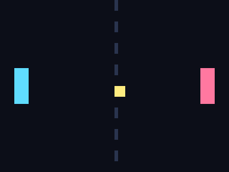

# Running pong inside the type checker

`pnpm arcade` compiles `pong-tiny.wasm` into TypeScript types and plays it. Each
frame is **one type evaluation**: the host hands the previous frame's memory in
as a type argument, `tsgo` computes the next frame, and the bytes that come back
are drawn. Roughly **18 frames per second** for the character version, **25-33**
for the pixel one.



That is a real framebuffer: 64x48 bytes of palette index, living in the wasm
memory the checker hands back each frame, recorded straight out of a run with
`GIF=docs/pixel-pong.gif pnpm gfx`. Nothing in the picture is drawn by the host -
it maps indices to colours and nothing else.

```
  pong, running inside the TypeScript type checker
  +----------------------------------------+
  |                    |                   |
  | =                  |                   |
  | =                  |         00      = |
  | =                  |         00      = |
  |                    |                 = |
  +----------------------------------------+
  0 - 0   frame 12   3.7 fps   1 evaluation   state 9.5kB
```

- `pnpm gfx` - play the pixel version (`w`/`s` to move, `q` to quit)
- `pnpm gfx:verify` - compare all 3072 pixels against V8, frame by frame
- `pnpm arcade` - play the character version
- `pnpm arcade:verify` - run the same wasm in V8 and compare every frame byte for byte
- `pnpm arcade:conform` - compile and check every module in `conformance-tests` against the engine
- `pnpm arcade:ceiling` - measure how much work one type evaluation can do

Current state: **64/64 supported modules and every pong frame are identical to the
wasm engine** (`pnpm arcade:conform`), conway included. Unsupported so far: i64,
floats, `call_indirect`, and imported-function calls.

## How it works

`cargo run -- --aot-cfg module.wasm` writes `module.cfg.ts`. Every wasm basic
block becomes a type; `br`, `br_if`, `br_table` and loop back-edges become tail
calls to those types; `if`/`else` join through a shared continuation. Nothing is
"skipped forward N ends" - the control flow graph is real, which is why loops and
nested branches behave.

Each block takes `(fuel, memory, globals, locals, stack)` and returns either

- `['r', memory, value?]` - the function returned, or
- `['s', 'fn_block', memory, ...live values]` - it ran out of fuel

On suspend the host re-enters the named block with fresh fuel, so a run of any
length is a sequence of bounded evaluations. `drive.ts` does that; `trie.ts`
decodes the memory that comes back.

## Three things had to be measured, not guessed

**Memory cannot be an intersection.** `S['memory'] & Record<Addr, Value>` looks
right and is unusable: intersecting two different literals for one address gives
`never`, so the *second* write to a word poisons it - and `i32.store8` is a
read-modify-write, so four byte stores into one word are enough. Memory is a
sparse 8-way trie keyed by address bits instead, which is why a write is
`$Put` and not an intersection.

**The state has to come back as printable text, and the printer gives up before
the checker does.** With a 14-level binary trie the *type* was always correct -
960 stores in one evaluation, every byte verified - but the type *printer* elides
deeply nested parts, printing them as `any`. Pasting that back silently corrupted
memory: a whole subtree of the screen would revert. An 8-way trie is 5 levels
deep, which prints cleanly, and `drive.ts` now validates every chunk against
exactly what the compiler is supposed to emit and refuses anything else.

**Depth is spent on nesting, not on work.** `I32Add<I32Add<..>,..>` inside
`$Store8` inside `$Put` stacks each operator's ~32 levels of bit recursion into
one chain, and ts-type-math raises TS2589 long before a block finishes. The
compiler emits SSA - every intermediate value gets a name - so a block is a flat
sequence of conditionals. After that, one evaluation handles 960 stores.

The speed came from the same observation applied to memory access: a byte store
is not arithmetic, it is *string surgery*. `$Off` reads the low two bits of an
address as the last two characters of its 32-character string, and `$SetByte`
splices eight characters into a word. No shifting, no masking, no adders. That
took pong's first frame from 26 evaluations and 5.5s down to one evaluation at
0.27s.

## Calls

An exported function is compiled *metered*: its blocks charge fuel and can
suspend. Anything it calls is compiled again in an *unmetered* flavour (`$u...`)
that runs to completion inside the caller's evaluation and hands back
`['r', memory, ...globals, value?]`, so a callee's writes to memory and to
globals are not lost. Suspending in the middle of a call would need a call stack
in the state, so for now a callee has to fit in one evaluation - fine for
conway's helpers, not yet enough for something as deep as DOOM.

## What an operation costs

`pnpm tsx packages/playground/cfg/bench.ts` times a 200-iteration wasm loop per
operation. Marginal cost of one operation, inside one evaluation:

| operation | µs |
| --- | --- |
| empty loop iteration (hop + add + compare) | ~157 |
| `i32.and` with a constant | ~10 |
| `i32.add` | ~50 |
| `i32.load8_u` | ~200 |
| `i32.store8` | ~210 |

The useful surprise: **the algorithm barely matters, the instantiation does.** A
hand-written 32-bit adder built from nibble lookup tables measured *slower* than
ts-type-math walking all 32 bits (130µs vs 110µs), and a hand-written comparison
lost too. What wins is collapsing an operation into a *single* template-literal
conditional - masks and constant shifts drop from ~100µs to ~10µs, and equality
becomes `A extends B`, no pattern at all. So the compiler specialises exactly
those and leaves the rest to ts-type-math.

A steady pong frame is ~120 hops and ~900 primitive operations. Getting
meaningfully faster needs *fewer operations*, not a faster adder.

## The thing that actually cost the most

A block is a chain of nested `infer`s, one per instruction:

```ts
Op<...> extends infer $t0 extends WasmValue
? Op<$t0, ...> extends infer $t1 extends WasmValue
? ...
```

The checker resolves that shape in time **exponential in its depth**. Measured on
a chain of i32 adds (`probes/probe-depth-run.ts`):

| depth | time |
| --- | --- |
| 8 | 6ms |
| 16 | 19ms |
| 18 | 57ms |
| 20 | 213ms |
| 22 | 798ms |
| 24 | 3214ms |
| 32 | did not finish in 17 minutes |

So a long basic block is not slow, it is fatal, and nothing stops a program from
having one. Blocks now cut themselves in two every 6 instructions and hand the
rest to a fresh block, which costs one hop (~200µs) and buys back an unbounded
amount. That one change took the worst benchmark from 1728µs an iteration to
182µs, and pong from 4.6 to 18 fps. The old ceiling had been luck: these
programs happened to top out at 17-deep blocks, just under the knee.

There is a way out of the shape entirely. Threading state through *alias
applications* instead of nested infers is linear - 128 sequenced adds in 17ms,
against 3214ms for 24 of them nested (`probes/probe-pipeline-run.ts`):

```ts
type $step<$S extends WasmValue[]> = [Wasm.I32Add<$S[0], '...'>, ...$S]
$step<$step<$step<...>>>
```

That would remove the ceiling rather than dodge it, and let a block be as long
as it likes. It is not implemented.

## What is not true

Type arguments are not individually expensive, which is worth stating because
the opposite is easy to conclude. A loop carrying 20 string parameters costs the
same per iteration as one carrying 2 (`probes/probe-arity-run.ts`); an earlier
measurement suggesting ~90µs per argument turned out to be a fixed cost hiding
in a deep block, and the fix was the depth cap, not the arity. Passing fewer
locals per block still helps - about 25% - by shrinking the state threaded
through every hop and rebuilt in every suspend payload, not by saving a
per-argument fee.

Fuel length is free too: padding the fuel string by 16,000 characters changes
nothing measurable.

## Writing a game for this machine

The compiler is only half of it; the program can be shaped for the costs above.
The pixel game does three things a normal pong would not:

- **paddles four pixels wide and four-aligned.** A whole word costs one store,
  the same as one byte, because memory is a trie of 32-bit words and touching
  one byte means read, splice, write. Ten stores instead of forty.
- **the centre line precomputed into a table.** `(y / 3) % 2` per row per frame
  becomes one load per row, and only the rows the ball wiped are repainted.
- **delta redraw.** The court is painted once; each frame erases the previous
  ball and paddles and draws the new ones, so a steady frame is ~40 stores
  regardless of screen size.

Steady frame 0.06s -> 0.03s, with every pixel still identical to V8.

Unrolling the sprite loops took the work in a frame from 278 units to 102 - a
paddle row inside a loop costs the store plus a compare, an increment and a
jump, while unrolled the row offsets fold into the store instruction. The frame
time did not move. Fuel counts hops and stores, not arithmetic, and what
unrolling removed were the cheap units; a store at ~200µs is now most of a
frame. Worth keeping for the headroom, not for the clock.

Two other things that did not work, recorded so they are not tried twice:

- **a wider trie.** 32-way, three levels deep, against 8-way at five: 0.04s a
  frame against 0.03s. Rebuilding a 32-element node costs more than the two
  levels it saves. `TRIE_DIGIT_BITS` sweeps it.
- **blaming the infer constraint.** `infer $t extends WasmValue`, `infer $t
  extends string` and a plain `infer $t` all explode identically with depth
  (~3.2s at 24). The nesting is the problem, not the constraint.

The floor, for reference: an evaluation that hands back the same 30kB of state
without touching it costs 4ms. A frame is 33ms, so the round trip is not what is
in the way yet.

## Fuel

Fuel is a string of `'1'`s, one per unit of work, and a block charges one per hop
plus one per store. Taking a prefix off a string is free; the obvious
`[any, ...infer Rest]` tuple copies every remaining element on every hop, and at
a few thousand units that alone dominated the frame.

The host starts optimistic and backs off: if a chunk comes back with TS2589, or
prints something that is not a fully concrete state, fuel is halved and the same
block is retried. Whatever fuel survives is reused for the next frame, so the
runtime settles onto the checker's real limit instead of assuming one.
